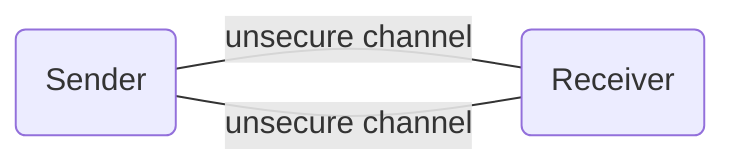

## Network Security

A network is secure enough if it provides the features:
- Message Confidentiality
- integrity
- authenticiation
- non-repudiation

### What is message encryption?
In layman terms, it is to hide the message sent from sender from others except the authorized ones.

Encryption uses complex algorithms known as ==cipher== to scramble data and decrypts the same data using a key provided by the message sender. Encryption ensures that information stays private and confidential, whether it’s being stored or in transit. Any unauthorized access to the data will only see a chaotic array of bytes.

There are two types of encryption:-
	1. Symmetric
	2. Asymmetric

#### Symmetric
Here a single key is used for both encryption and decryption of messages. This key has to remain secret at any cost to ensure privacy.
		- this encryption is the most effecient and faster.

Some encryption algorithms include
- AES
- DES
- 3DES

###### DES - Data Encryption Standard
In “modern” computing, DES was the first standardized cipher for securing electronic communications, and is used in variations (e.g. 2-key or 3-key 3DES). The original DES is not used anymore as it is considered too “weak”, due to the processing power of modern computers.

###### 3DES - Triple DES
3DES is not recommended by NIST and PCI DSS 3.2, just like all 64-bit ciphers too. However, 3DES is still widely used in EMV chip cards.

###### AES - Advanced Encryption Standard
Originally known as 'Rijndael', this is the most commonly used algorithm and set as standard by the NIST.
AES is comprised of AES-128, AES-192 and AES-256. 

##### Uses
-> Payment applications, such as card transactions where PII needs to be protected to prevent identity theft or fraudulent charges
-> Validations to confirm that the sender of a message is who he claims to be
-> Random number generation or hashing.

Even though it has its advantages, it has its own fair share of disadvantages:-

##### Drawbacks
1.  Key Exhaustion
2. Attribution data
3. Key Management at large scale

#### Asymmetric
In this type of encryption, there are two different keys, **public key** used for encryption and **private key** used for decryption.

Suppose Alice and Bob want to communicate to each other. Both Alice and Bob generate their public and private keys. Both Alice and Bob broadcast their public keys to the world. If Alice wants to send a message first, it encrypts using Bob's public key and sends the encrypted message to Bob, and Bob decrypts using his private key. only Bob can decrypt the message since only he has the private key required to decrypt.

During sending of message from A to B (say), only the receiver's pair of keys are required.

>[!info] How are the two keys generated?
At the heart of **Asymmetric Encryption** lies a cryptographic algorithm. This algorithm uses a key generation protocol (a kind of mathematical function) to generate a key pair. Both the keys are mathematically connected with each other. This relationship between the keys differs from one algorithm to another.

Some encryption algorithms include
- RSA
- ECC

##### RSA

#### Problems Faced 
1. **Timing attacks** - If the attacker Eve knows Alice's hardware in sufficient detail and is able to measure the decryption times for several known ciphertexts, Eve can deduce the decryption key _d_ quickly.
2. **Adaptive chosen-ciphertext attacks** - A variant of this attack, dubbed "BERserk", came back in 2014. It impacted the Mozilla NSS Crypto Library, which was used notably by Firefox and Chrome.
3. **Side-channel analysis attacks** - Some authors claim to have discovered 508 out of 512 bits of an RSA key in 10 iterations with SBPA.
4. **Resource-Intensive**

###### Solution
<u>Hybrid Approach of both symmetric and asymmetric encryption</u> - In **SSL/TLS and other digital certificates**,First, when two parties (browser and server in the case of SSL) come across each other, they validate each other’s private and public key through Asymmetric Encryption. Once the verification is successful and both know whom they’re talking to, the encryption of the data starts – through Symmetric Encryption. Thereby saving significant time and serving the purposes of confidentiality and data-protection. This entire process is called an SSL/TLS handshake.
### Note
Confidentiality and integrity are reached when data is encrypted asymmetrically, as only the intended recipient can decrypt the message. Non-repudiation and authenticity occur due to digital signing.
### What is message signature?
Alice wants to send a message to Bob again. The problem of encrypting the data is solved using the above method. 

But what if I am sitting between Alice and Bob, introducing myself as 'Alice' to Bob and sending my own message to Bob instead of forwarding the one sent by Alice. Even though I can not decrypt and read the original message sent by Alice(that requires access to Bob's private key) I am hijacking the entire conversation between them.

Is there a way Bob can confirm that the messages he is receiving are actually sent by Alice?

-   Alice signs the message with her private key and sends it over. (In practice, what is signed is a hash of the message, e.g. SHA-256 or SHA-512.)
-   Bob receives it and verifies it using Alice's public key. Since Alice's public key successfully verified the message, Bob can conclude that the message has been signed by Alice.

When signing, you use your private key to write message's signature, and they use your public key to check if it's really yours.

A signature is proof that the signer has the private key that matches some public key. To do this, it would be enough to encrypt the message with that sender's private key, and include the encrypted version alongside the plaintext version. To verify the sender, decrypt the encrypted version, and check that it is the same as the plaintext.

Of course, this means that your message is not secret. Anyone can decrypt it, because the public key is well known. But when they do so, they have proved that the creator of the ciphertext has the corresponding private key.

To protect data from compromise and authenticate the sender at the same time, encryption and digital signing are used together. They are also both used in tandem to fulfill compliance standards for companies. Standards, like the Federal Information Processing Standards (FIPS) or the General Data Protection Regulation (GDPR), require companies to protect data as securely as possible along with authenticating data received from others. Encryption and digital signing ensures these standards are reached, and that users can be secure in the knowledge that data that is sent to and from them will not be compromised.

### Common Encryption and Signing Algorithms

**Symmetric Encryption Algorithms**:

-   Advanced Encryption Standard (AES)
-   Blowfish
-   Twofish
-   Rivest Cipher (RC4)
-   Data Encryption Standard (DES)

**Asymmetric Encryption Algorithms**:

-   Elliptic Curve Digital Signature Algorithm (ECDSA)
-   Rivest-Shamir-Adleman (RSA)
-   Diffie-Hellman
-   Pretty Good Privacy (PGP)

**Signing Algorithms**:

-   RSA
-   ElGamal Encryption System
-   Digital Signing Algorithm (DSA)
-   ECDSA

### ECDSA
Elliptic Curve Digital Signature Algorithm, or ECDSA, is one of the more complex public key cryptography encryption algorithms. Keys are generated via elliptic curve cryptography that are smaller than the average keys generated by digital signing algorithms. Mainly used for the creation of pseudo-random numbers, digital signatures, and more. A digital signature is an authentication method used where a public key pair and a digital certificate are used as a signature to verify the identity of a recipient or sender of information.

**Benefits**
The complexity of ECDSA means that ECDSA is more secure against current methods of encryption cracking encryptions. Along with being more secure against current attack methods, ECDSA also offers a variety of other benefits as well. It is new compared to others.

**Demerits**
Yet, RSA is still the most widely used public key cryptography method. This is due to the length of time RSA has been around, among other reasons. Though attackers have had more time to crack RSA, it is still the tried and true method used all across the Internet for digital signing, SSL/TLS transport, and more. A drawback of ECDSA is that it is complex to implement, whereas RSA is more easily set-up in comparison. The simplicity of RSA is often a draw to organizations, as it offer less roadblocks in its set-up. The downfall of many different organizations using ECDSA that have been hacked is the improper implementation of ECDSA itself, as it is complex to implement in the first place.

In December 2010, a group calling itself fail0verflow announced recovery of the ECDSA private key used by Sony to sign software for the PlayStation 3 game console. However, this attack only worked because Sony did not properly implement the algorithm, because 
k was static instead of random. As pointed out in the Signature generation algorithm section above, this makes dA solvable, rendering the entire algorithm useless.

